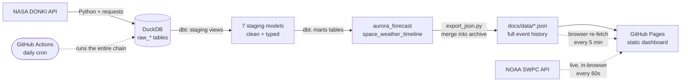

# 🛰️ DONKI Space Weather Dashboard

A live, public, **self-updating** space-weather dashboard built on a real data-engineering pipeline — from NASA's raw API all the way to a polished static site, refreshed automatically every day at **$0/month**.

**🔗 Live site: https://sayedomarhashimi.github.io/donki-space-weather/**

It tracks solar flares, coronal mass ejections (CMEs), and geomagnetic storms from NASA's [DONKI](https://ccmc.gsfc.nasa.gov/tools/DONKI/) database, turns them into an aurora-visibility outlook and an **interactive event calendar**, and layers **real-time current conditions** from NOAA on top.

---

## What this project demonstrates

This isn't a static webpage — it's a small but complete **production data system**:

- **Extraction** of nested JSON from a live API, decomposed into a clean relational model (Python + pandas)
- **A warehouse** with idempotent, incremental daily loads (DuckDB)
- **Transformation** through a layered dbt project (staging → marts)
- **Serving** the results as a static, dependency-free front-end
- **Orchestration** of the whole chain on a schedule, in the cloud, for free (GitHub Actions)

---

## Architecture



**Two data layers, honestly labeled:**
- **DONKI pipeline** → a daily-refreshed *event history*. Each run pulls a trailing 7-day window from NASA, but the exporter **accumulates** into `timeline.json`, so the calendar keeps every event since launch — a permanent, growing archive.
- **NOAA real-time layer** → *current conditions* (planetary Kp + storm scales), fetched directly in the browser every 60 seconds — no server, no pipeline. This drives both the "Live Now" strip **and the main Kp gauge / aurora outlook**, so the meter always reflects the latest measurement.

**Why the gauge reads live NOAA, not DONKI:** DONKI's geomagnetic-storm feed only records Kp *during storms*, so between storms it has no fresh reading and the derived `aurora_forecast.json` would sit frozen on the last storm (going progressively "stale"). NOAA SWPC publishes planetary Kp continuously, so the front-end drives the gauge, outlook, source, last-Kp and observed-time from that live feed — and falls back to the DONKI `aurora_forecast.json` snapshot only when NOAA is unreachable (or when previewing offline).

---

## How it works, step by step

### 1. Extraction — Python (`extraction/`)

Three scripts pull a **trailing 7-day window** from DONKI and **upsert** into DuckDB by primary key, so re-running never creates duplicates (idempotent, incremental).

| Script | Tables written | Notes |
|---|---|---|
| `donki_flr.py` | `raw_flr` | Solar flares — flat schema, PK `flrID` |
| `donki_cme.py` | `raw_cme`, `raw_cme_analyses`, `raw_cme_enlil`, `raw_cme_impacts` | CMEs have real nested structure, so the deeply-nested JSON is **decomposed into 4 related tables** (a CME → many analyses → many model runs → many predicted impacts) |
| `donki_gst.py` | `raw_gst`, `raw_gst_kp_index` | Geomagnetic storms split into storm events + their one-to-many Kp-index readings |

Nested fields (`instruments`, `linkedEvents`, etc.) are preserved as JSON strings rather than dropped. Upserts use DuckDB's `INSERT … ON CONFLICT (pk) DO UPDATE`.

### 2. Warehouse — DuckDB

All raw tables live in a single file-based warehouse, `warehouse/space_data.duckdb` (gitignored). DuckDB gives a zero-setup, embedded analytical database — no server to run or pay for.

### 3. Transformation — SQL via dbt Core (`dbt_project/`)

A layered dbt project turns raw API dumps into analytics-ready models. **Staging = views, marts = tables.**

**Staging (7 models)** — one per raw table. Each renames the API's `camelCase` columns to `snake_case`, casts types, and cleans values. Two examples of the real work involved:

```sql
-- stg_donki_flr.sql — split a flare class like "M2.3" into its parts
substr("classType", 1, 1)                    as flare_class,      -- 'M'
try_cast(substr("classType", 2) as double)   as flare_magnitude,  -- 2.3
```

```sql
-- DONKI timestamps are minute-precision ("2026-08-10T12:34Z"), so a plain
-- cast fails in DuckDB — parse them explicitly instead:
strptime("beginTime", '%Y-%m-%dT%H:%MZ')     as begin_time,
```

**Marts (2 models)** — the business logic:
- **`aurora_forecast`** — takes the most recent Kp reading and buckets it into an aurora-visibility level (`Kp ≥ 7` → high, `Kp ≥ 5` → moderate, else low).
- **`space_weather_timeline`** — `UNION`s flares, CMEs, and storms into one chronological event feed with a shared schema (`event_id`, `event_type`, `event_time`, `description`, `severity_score`).

### 4. Export — Python (`exports/export_json.py`)

Reads the two marts over a **read-only** DuckDB connection and writes them to `docs/data/aurora_forecast.json` and `docs/data/timeline.json` — the exact files the front-end fetches.

The timeline export **merges** fresh events into the already-committed `timeline.json`, keyed by `event_id`: new or revised events win on conflict (so DONKI corrections propagate), while events that have aged out of the 7-day extraction window are preserved. This makes the git-tracked JSON the durable archive — it accumulates all history since launch and is self-healing even if the DuckDB warehouse cache is ever lost. The merge is idempotent and output stays sorted newest-first.

### 5. Front-end — static HTML/CSS/JS (`docs/index.html`)

A single, dependency-free page (no build step, no framework):
- A **custom inline-SVG Kp gauge** (animated needle, threshold color bands) — hand-drawn in JS, no charting library. It reads the **live NOAA SWPC planetary Kp** so the meter, aurora outlook and freshness badge always reflect the latest measurement, falling back to the DONKI snapshot only if NOAA is unreachable.
- The **"Live Now" strip** — fetches NOAA SWPC feeds client-side and auto-refreshes every 60s.
- An **interactive event calendar** — a month grid with per-day event counts and type-colored dots, month navigation, a "Latest" jump, type filters (flares / CMEs / storms), and a detail panel for the selected day. A footer line reports the archive size and its launch date.
- **Background auto-refresh** — the page re-fetches the published JSON every 5 minutes (and whenever the tab regains focus), updating in place without disturbing the current month, selected day, or filter.
- Tasteful **scroll-reveal + count-up animations** (vanilla `IntersectionObserver`, reduced-motion-safe).
- Served from the `docs/` folder by **GitHub Pages**.

### 6. Orchestration — GitHub Actions (`.github/workflows/refresh-data.yml`)

The Airflow stand-in. On a **daily cron (06:00 UTC)** (and on-demand), a runner:

1. Installs dependencies and restores the DuckDB warehouse from an Actions **cache** (a working-set optimization so the extractors have recent raw data on hand).
2. Runs the three extractors → **dbt run** → the JSON export (which merges into the committed archive).
3. **Commits the refreshed JSON back to the repo**, which triggers a GitHub Pages redeploy.

Long-term history durability comes from the git-tracked `timeline.json`, not the Actions cache — so even if the cache is evicted, the accumulated archive survives and the next run rebuilds on top of it.

The result: the site updates itself with zero human involvement, entirely on free infrastructure.

---

## Tech stack

| Layer | Tooling |
|---|---|
| Extraction | Python, `requests`, `pandas`, `python-dotenv` |
| Warehouse | DuckDB |
| Transformation | dbt Core + `dbt-duckdb` |
| Front-end | Vanilla HTML / CSS / JS, inline SVG |
| Orchestration | GitHub Actions (cron) |
| Hosting | GitHub Pages |
| Data | [NASA DONKI](https://ccmc.gsfc.nasa.gov/tools/DONKI/) · [NOAA SWPC](https://www.swpc.noaa.gov/) |

---

## Project structure

```
donki-space-weather/
├── extraction/              # Python: NASA API → DuckDB (idempotent upserts)
│   ├── donki_flr.py
│   ├── donki_cme.py
│   └── donki_gst.py
├── warehouse/               # DuckDB warehouse (gitignored)
├── dbt_project/
│   └── models/
│       ├── staging/         # 7 view models: rename, type, clean
│       └── marts/           # aurora_forecast, space_weather_timeline
├── exports/
│   └── export_json.py       # marts → docs/data/*.json (merges into the archive)
├── docs/                    # GitHub Pages source
│   ├── index.html           # the dashboard (interactive calendar)
│   └── data/                # published JSON — timeline.json is the growing archive
└── .github/workflows/
    └── refresh-data.yml     # daily extract → dbt → export → commit
```

---

## Running it locally

```bash
# 1. Setup
python -m venv .venv && source .venv/bin/activate
pip install -r requirements.txt

# 2. Add your free NASA key (https://api.nasa.gov) to a .env file
echo "NASA_API_KEY=your_key_here" > .env

# 3. Extract → transform → export
python extraction/donki_flr.py
python extraction/donki_cme.py
python extraction/donki_gst.py
cd dbt_project && dbt run && cd ..
python exports/export_json.py

# 4. Preview the site (fetch() needs a real server, not file://)
cd docs && python -m http.server 8000
# open http://localhost:8000
```

> dbt commands must be run from inside `dbt_project/`.

---

## Credits

- Space-weather event data: **NASA DONKI** (Space Weather Database Of Notifications, Knowledge, Information)
- Real-time conditions: **NOAA Space Weather Prediction Center (SWPC)**

Built by **Sayed Hashimi** — [github.com/SayedOmarHashimi](https://github.com/SayedOmarHashimi)
